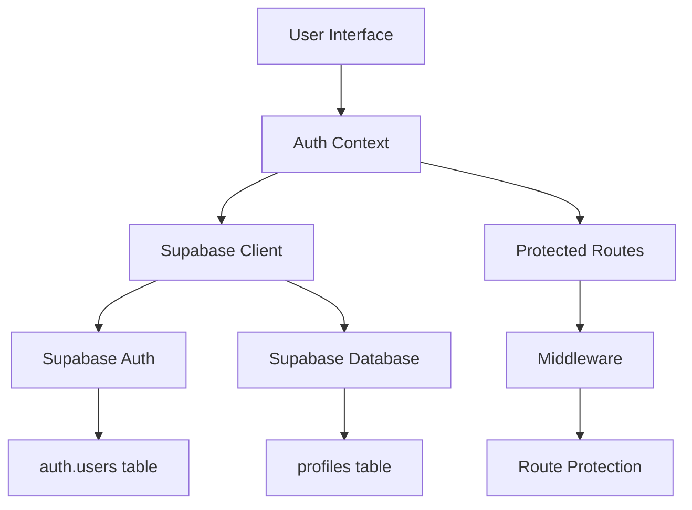

# Design Document - Sistema de Autenticação de Usuários

## Overview

O sistema de autenticação será implementado usando Next.js 14 com App Router, integrado ao Supabase para gerenciamento de usuários e armazenamento de dados. A arquitetura seguirá padrões modernos de React com Context API para gerenciamento de estado global de autenticação, componentes reutilizáveis e middleware para proteção de rotas.

A solução utilizará a biblioteca oficial do Supabase (@supabase/supabase-js) e aproveitará as funcionalidades nativas de autenticação do Supabase, incluindo Row Level Security (RLS) para proteção de dados.

## Architecture

### Estrutura de Diretórios
```
app/
├── auth/
│   ├── login/
│   │   └── page.tsx
│   ├── register/
│   │   └── page.tsx
│   └── profile/
│       └── page.tsx
├── middleware.ts
└── layout.tsx

components/
├── auth/
│   ├── LoginForm.tsx
│   ├── RegisterForm.tsx
│   ├── ProfileForm.tsx
│   └── AuthGuard.tsx
└── ui/
    ├── Button.tsx
    ├── Input.tsx
    └── FormField.tsx

contexts/
├── AuthContext.tsx
└── LanguageContext.tsx (existing)

lib/
├── supabase/
│   ├── client.ts
│   ├── server.ts
│   └── types.ts
├── validations/
│   └── auth.ts
└── utils/
    └── auth.ts

types/
└── auth.ts
```

### Fluxo de Dados


## Components and Interfaces

### 1. Supabase Configuration

**Client Configuration:**
- Configuração do cliente Supabase para uso no lado do cliente
- Gerenciamento de sessões e tokens
- Configuração de cookies para SSR

**Server Configuration:**
- Cliente Supabase para uso em Server Components
- Configuração para middleware e API routes

### 2. Authentication Context

**AuthContext Interface:**
```typescript
interface AuthContextType {
  user: User | null
  profile: UserProfile | null
  loading: boolean
  signUp: (data: SignUpData) => Promise<AuthResult>
  signIn: (email: string, password: string) => Promise<AuthResult>
  signOut: () => Promise<void>
  updateProfile: (data: ProfileUpdateData) => Promise<AuthResult>
  refreshSession: () => Promise<void>
}
```

**Funcionalidades:**
- Gerenciamento de estado global do usuário
- Métodos para autenticação (login, registro, logout)
- Sincronização automática com Supabase
- Persistência de sessão

### 3. Form Components

**LoginForm:**
- Campos: email, senha
- Validação em tempo real
- Tratamento de erros
- Loading states

**RegisterForm:**
- Campos: nome, email, telefone, senha, confirmação de senha
- Validação completa de dados
- Verificação de força da senha
- Formatação automática do telefone

**ProfileForm:**
- Edição de dados do perfil
- Validação de alterações
- Confirmação para mudanças sensíveis

### 4. UI Components

**FormField:**
- Wrapper para inputs com label, erro e validação
- Suporte a diferentes tipos de input
- Acessibilidade integrada

**Button:**
- Estados de loading
- Variantes (primary, secondary, danger)
- Suporte a ícones

**Input:**
- Validação visual
- Tipos específicos (email, password, tel)
- Máscaras para telefone

## Data Models

### 1. Supabase Auth User
```sql
-- Tabela nativa do Supabase (auth.users)
-- Gerenciada automaticamente pelo Supabase
```

### 2. User Profile Table
```sql
CREATE TABLE profiles (
  id UUID REFERENCES auth.users(id) ON DELETE CASCADE PRIMARY KEY,
  name TEXT NOT NULL,
  phone TEXT,
  avatar_url TEXT,
  created_at TIMESTAMP WITH TIME ZONE DEFAULT NOW(),
  updated_at TIMESTAMP WITH TIME ZONE DEFAULT NOW()
);

-- Row Level Security
ALTER TABLE profiles ENABLE ROW LEVEL SECURITY;

-- Policies
CREATE POLICY "Users can view own profile" ON profiles
  FOR SELECT USING (auth.uid() = id);

CREATE POLICY "Users can update own profile" ON profiles
  FOR UPDATE USING (auth.uid() = id);

CREATE POLICY "Users can insert own profile" ON profiles
  FOR INSERT WITH CHECK (auth.uid() = id);
```

### 3. TypeScript Interfaces
```typescript
interface User {
  id: string
  email: string
  email_confirmed_at?: string
  created_at: string
}

interface UserProfile {
  id: string
  name: string
  phone?: string
  avatar_url?: string
  created_at: string
  updated_at: string
}

interface SignUpData {
  name: string
  email: string
  password: string
  phone?: string
}

interface AuthResult {
  success: boolean
  error?: string
  data?: any
}
```

## Error Handling

### 1. Validation Errors
- Validação no frontend usando Zod ou similar
- Mensagens de erro em português
- Feedback visual imediato

### 2. Supabase Errors
- Mapeamento de códigos de erro do Supabase
- Mensagens user-friendly
- Logging para debugging

### 3. Network Errors
- Retry automático para falhas de rede
- Fallback para modo offline
- Indicadores de conectividade

### 4. Error Boundaries
- Captura de erros em componentes React
- Páginas de erro customizadas
- Relatório de erros para monitoramento

## Testing Strategy

### 1. Unit Tests
- Validação de formulários
- Funções utilitárias
- Context providers
- Componentes isolados

### 2. Integration Tests
- Fluxos de autenticação completos
- Integração com Supabase (usando mocks)
- Navegação entre páginas
- Persistência de sessão

### 3. E2E Tests
- Registro de usuário completo
- Login e logout
- Atualização de perfil
- Proteção de rotas

### 4. Security Tests
- Validação de tokens
- Proteção contra XSS
- Sanitização de inputs
- Testes de autorização

## Security Considerations

### 1. Authentication Security
- Uso de tokens JWT do Supabase
- Refresh tokens automáticos
- Expiração de sessão configurável

### 2. Data Protection
- Row Level Security no Supabase
- Validação server-side
- Sanitização de inputs

### 3. Route Protection
- Middleware para rotas protegidas
- Redirecionamento automático
- Verificação de permissões

### 4. Environment Variables
- Chaves do Supabase em variáveis de ambiente
- Configuração diferente para dev/prod
- Validação de configuração na inicialização